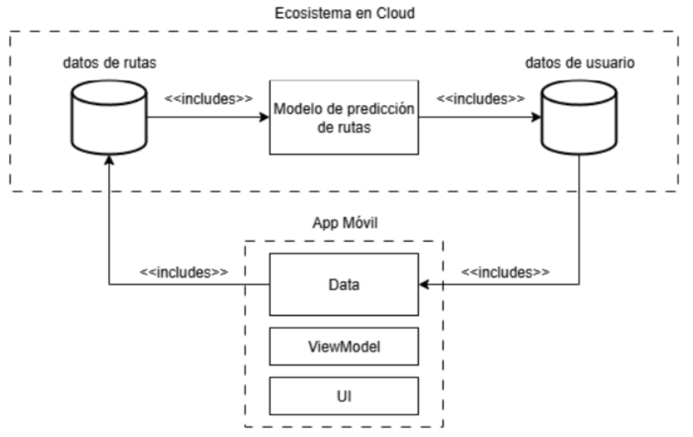
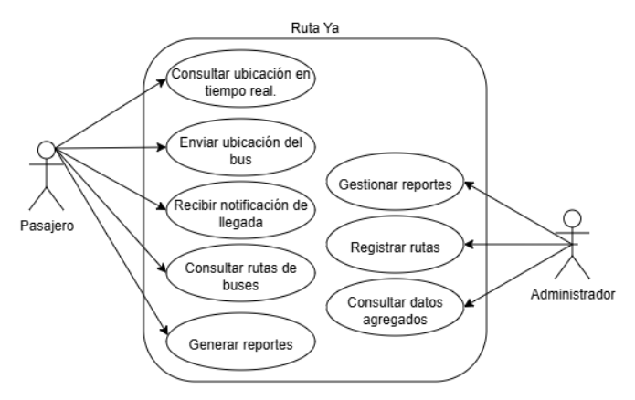

# Backend de Estimación de Rutas y Monitoreo - Popayán

Este repositorio contiene el servidor backend y el dashboard administrativo para una aplicación móvil de transporte público en Popayán.

## Descripción

El sistema consta de dos componentes principales:
1.  **API Server (`server.py`)**: Un servidor Flask que provee endpoints para la aplicación móvil. Maneja la estimación de rutas, cálculo de tarifas, y seguimiento de buses en tiempo real.
2.  **Dashboard Administrativo (`dashboard.py`)**: Una interfaz web para visualizar la ubicación de los buses en tiempo real, simular el movimiento de buses para pruebas, y monitorear el estado del sistema.

Este backend está diseñado para dar soporte a una aplicación móvil (repositorio separado) que permite a los usuarios planificar sus viajes en transporte público.

## Arquitectura

El sistema sigue una arquitectura cliente-servidor donde la App Móvil y el Dashboard consumen la API REST expuesta por el servidor.



## Casos de Uso

Los principales casos de uso implementados incluyen:
-   Estimación de ruta (tiempo, distancia, costo) entre dos puntos.
-   Visualización de buses en tiempo real.
-   Simulación de movimiento de buses para pruebas de integración.



## Requisitos

-   Python 3.8+
-   Flask
-   Requests
-   Flask-CORS

## Instalación

1.  Clona el repositorio.
2.  Crea un entorno virtual (opcional pero recomendado):
    ```bash
    python -m venv .venv
    # Windows
    .venv\Scripts\activate
    # Linux/Mac
    source .venv/bin/activate
    ```
3.  Instala las dependencias:
    ```bash
    pip install -r requirements.txt
    ```

## Ejecución

Para levantar el sistema completo, necesitas correr ambos servicios en terminales separadas.

### 1. Iniciar el Servidor API
```bash
python server.py
```
El servidor iniciará en el puerto **3002**.

### 2. Iniciar el Dashboard
```bash
python dashboard.py
```
El dashboard iniciará en el puerto **5001**.
Accede a él en tu navegador: `http://localhost:5001`

## Configuración de IP

Si vas a conectar la App Móvil o acceder al dashboard desde otro dispositivo en la misma red:
1.  Asegúrate de que tu firewall permita conexiones entrantes a los puertos 3002 y 5001.
2.  Verifica tu IP local (`ipconfig` en Windows).
3.  Si la IP cambia, actualiza la variable `BACKEND_URL` en `dashboard.py` para que apunte a la IP correcta de tu máquina (ej. `http://192.168.1.7:3002`).

## Endpoints Principales

-   `GET /api/health`: Verificar estado del servidor.
-   `GET /api/rutas`: Listar todas las rutas y paradas.
-   `POST /api/estimate-route`: Calcular mejor ruta entre dos coordenadas.
-   `GET /api/buses`: Obtener ubicación actual de todos los buses activos.
-   `POST /api/simular-bus`: (Para pruebas) Iniciar la simulación de un bus recorriendo una ruta.